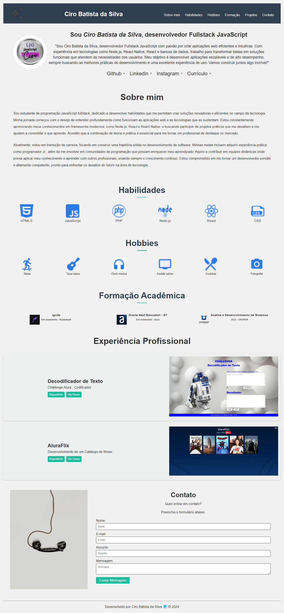

<h1 align="center"> Praticando Front End: Challenge Portfólio</h1>

#### ⚙️ Criação de um portfólio de apresentação. Desenvolvido para o desafio do curso `Praticando Front End: Challenge Portfólio` durante o <em>Oracle Next Education-T7</em> . ⚙️

 

  

 

 

## 🛠 Tecnologias

Esse projeto foi desenvolvido com as seguintes tecnologias:

- **[HTML](https://developer.mozilla.org/pt-BR/docs/Web/HTML)**
- **[CSS](https://developer.mozilla.org/pt-BR/docs/Web/CSS/CSS_flexible_box_layout/Basic_concepts_of_flexbox)**
- **[IA - Luri](https://www.alura.com.br/luri-inteligencia-artificial)**
- **[IA - ChatGPT](https://chatgpt.com/)**
- **[Figma](https://www.figma.com/)**
- **[Javascript](https://developer.mozilla.org/pt-BR/docs/Web/JavaScript)**

 

## 🎨 Layout

Você pode visualizar o layout do projeto através [DESSE LINK](https://www.figma.com/design/Mv4mSxBHzB5caI7bW2tLv6/Challenge-Front-end-Portf%C3%B3lio?node-id=0-1&node-type=canvas&t=CekqAHrJYoP86fN6-0). É necessário ter conta no [Figma](https://figma.com) para acessá-lo.

 

## 📝 License

  

Esse projeto está sob a licença MIT.

 

### 👨‍💻 Autor

 
 <em>Ciro Batista da Silva<em>
 
  

 
👋🏽 Entre em contato!

 

